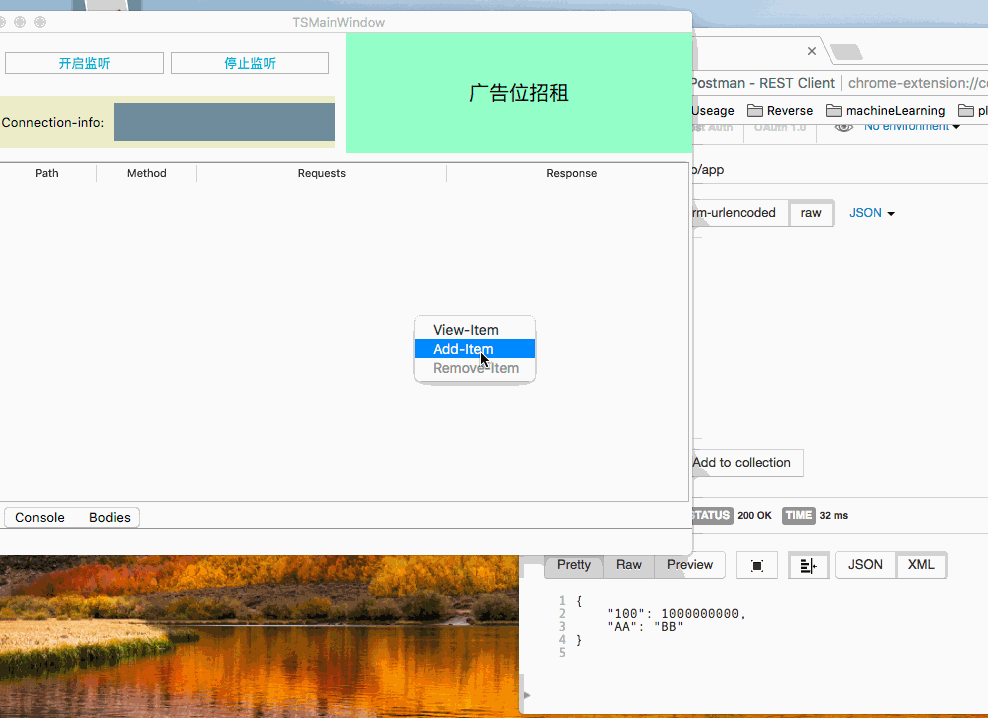

## TinyServer
A tiny server for developer, set request-content and response-content , when request's content-body(path && Method) is accord, return the response which u set before.

I think it will help developer data-debug effective, Don't need to write fake-data in the code.

## design with: Cpp-11  QT5.11.1  QtWebApp(A aswesome web design with Qt)

